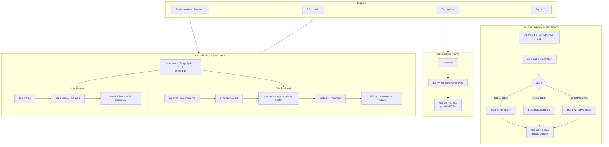
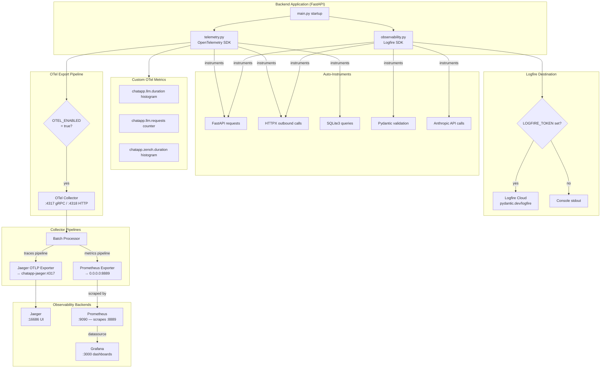
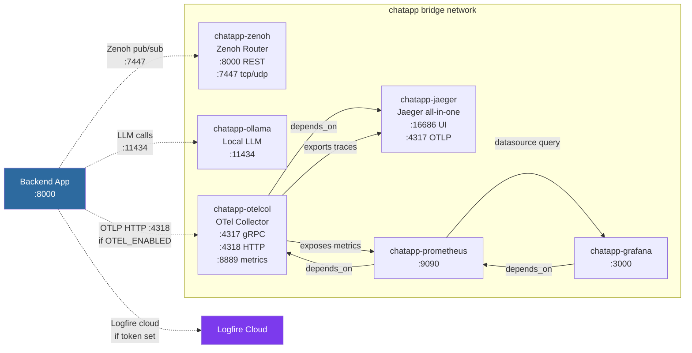
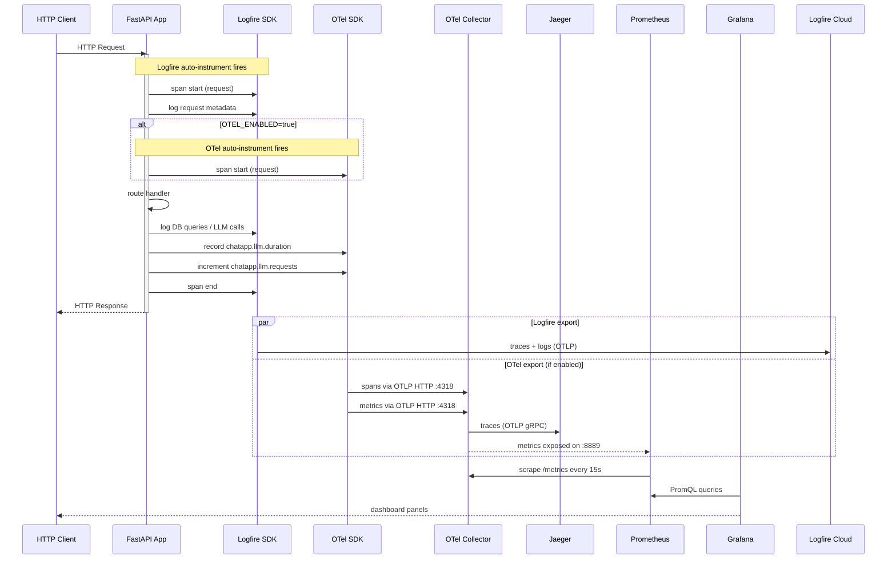
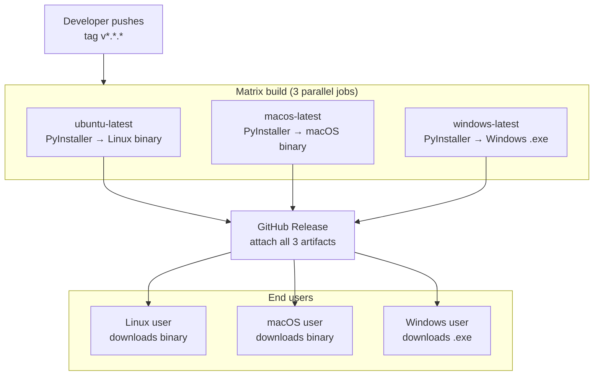

# DVerse Platform — Technical Diagrams

---

## 1. CI/CD Pipeline



---

## 2. Observability Stack Architecture



---

## 3. Docker Compose Service Dependency Graph



---

## 4. Telemetry Data Flow (Sequence)



---

## 5. Grafana Dashboard Panels (Metric Sources)

```mermaid
graph TD
    subgraph grafana["Grafana — chatapp dashboard"]
        subgraph http_panel["HTTP API"]
            P1[Request Rate\nrate(http_server_request_duration_seconds_count[5m])]
            P2[Latency p50\nhistogram_quantile(0.50 ...)]
            P3[Latency p95\nhistogram_quantile(0.95 ...)]
        end

        subgraph llm_panel["LLM Calls"]
            P4[Requests by Provider\nrate(chatapp_llm_requests_total[5m])\nby provider]
            P5[Requests by Status\nrate(chatapp_llm_requests_total[5m])\nby status]
        end

        subgraph zenoh_panel["Zenoh Bot Requests"]
            P6[Bot Request Duration\nhistogram_quantile(0.95,\nrate(chatapp_zenoh_duration_seconds_bucket[5m]))]
        end
    end

    PROM[Prometheus :9090] -->|default datasource| grafana
```

---

## 6. Logfire Observability Flow

```mermaid
flowchart LR
    subgraph sources["Instrumented Sources"]
        S1[FastAPI\nrequest spans]
        S2[HTTPX\noutbound HTTP]
        S3[Pydantic\nvalidation events]
        S4[Anthropic SDK\nLLM call spans]
        S5[Manual logfire.span()\nlogfire.info() calls]
    end

    subgraph scrubbing["Scrubbing Rules"]
        SC[Redact fields:\npassword / secret / token\napi_key / password_hash\naccess_token]
    end

    subgraph config["Config (observability.py)"]
        ENV{LOGFIRE_TOKEN\npresent?}
        CLOUD[Logfire Cloud\nService: chatapp-backend\nEnv: development\nPydantic recording: all]
        CONSOLE[Console exporter\nlocal dev fallback]
    end

    S1 & S2 & S3 & S4 & S5 --> scrubbing
    scrubbing --> ENV
    ENV -->|yes| CLOUD
    ENV -->|no| CONSOLE

    CLOUD --> VIZ[Logfire UI\nTrace explorer\nStructured logs\nPydantic validation view]
```

---

## 7. Bot Agent Build & Distribution Pipeline


